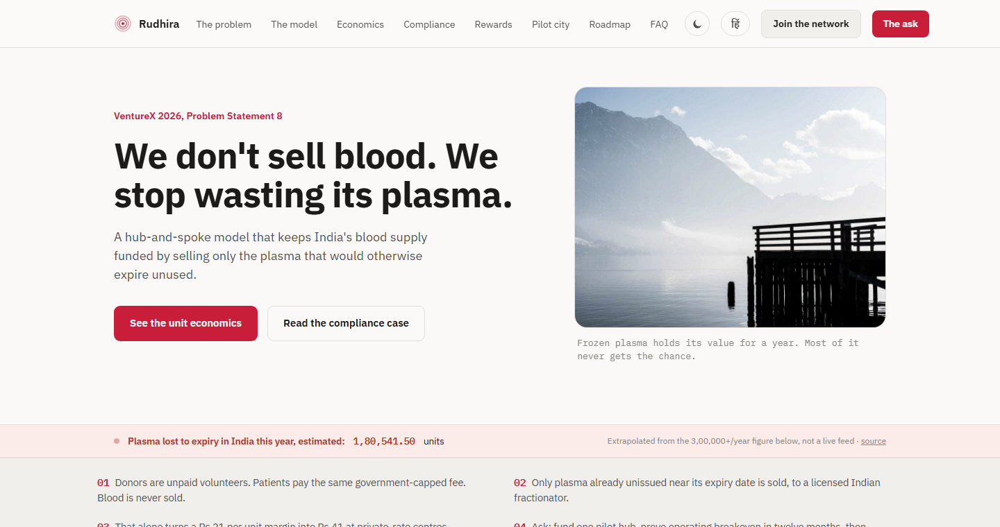

# Rudhira

**VentureX 2026 — Problem Statement 8: Blood & Plasma Supply Chain**
*Entrepreneurship Cell, IIT (ISM) Dhanbad*

**We don't sell blood. We stop wasting its plasma.**

Rudhira is a hub-and-spoke financing model that keeps India's blood supply
self-sustaining without commercialising blood — legally impossible under
*Common Cause v. Union of India* (1996) — by selling only the surplus plasma that blood
banks currently let expire.

**[Live site →](https://soaked1.github.io/rudhira-venturex/website/)**
**[Join-the-network concept preview →](https://soaked1.github.io/rudhira-venturex/website/join.html)**



## The idea, in one paragraph

Every whole-blood donation splits into red cells, platelets, and plasma. Red cells are
priced at a government-capped fee that barely covers cost. Plasma is the anomaly: it
freezes and holds value for about a year, is produced on every donation, and hospitals
clinically need far less of it than gets collected — so most of it currently expires
unused. **Only the portion already documented as surplus and near its expiry cutoff**,
never touching clinical supply, gets sold to a licensed Indian plasma fractionator. The
donor is never paid. The patient pays the same capped fee as always. That's the entire
legal argument, and it holds because nothing about it resembles paying for blood.

## What's in this repo

| Path | What it is |
|---|---|
| [`website/index.html`](website/index.html) | The full pitch: problem, model, unit economics (with a live interactive calculator), compliance case, donor rewards, pilot city comparison, roadmap, risks, FAQ, the ask, and sourced methodology |
| [`website/join.html`](website/join.html) | A concept preview (clearly labeled, not a live signup) showing how each side of the network — donors, hospitals, plasma fractionators — would sign up |
| [`VentureX_Problem_Statements.pdf`](VentureX_Problem_Statements.pdf) | The original competition problem statements |
| [`docs/superpowers/specs`](docs/superpowers/specs), [`docs/superpowers/plans`](docs/superpowers/plans) | Design spec and implementation plan for a later feature, kept for process transparency |

The site is plain HTML/CSS/JS — no framework, no build step, no backend. It runs by
opening the file directly or via any static file server.

## Highlights

- **Sourced, not asserted.** Every headline number (national plasma wastage, the
  fractionator price actually paid to AIIMS Nagpur, national fractionation capacity)
  links back to its source in the site's "Sources and methodology" section.
- **A live interactive unit-economics calculator** — drag the sliders to reproduce the
  margin numbers under your own assumptions.
- **A live wastage counter** — a running, honestly-labeled extrapolation of plasma lost
  to expiry in India so far this year, based on the cited annual figure.
- **Full bilingual support** — every section, including the calculator and the live
  counter, toggles cleanly between English and Hindi.
- **Non-monetary donor rewards**, designed around the same legal constraint the whole
  pitch rests on, including a de-identified donor impact-feedback feature that closes the
  loop without ever touching patient privacy.
- Dark/light theme, scroll-triggered motion (respects `prefers-reduced-motion`), and a
  short animated logo intro on first visit.

## Running it locally

No install required.

```bash
git clone https://github.com/SoAkeD1/rudhira-venturex.git
cd rudhira-venturex/website
# then just open index.html in a browser, or serve it:
python -m http.server 8000
```

## License

No license file is included — all content (business model, copy, and code) is submitted
as a competition entry and is not licensed for reuse.

## Credits

Built for VentureX 2026 by Team Rudhira.
